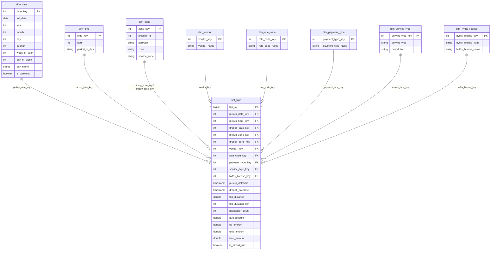

# Prova Teste - NYC Taxi Trips

Solucao de engenharia de dados para ingerir, disponibilizar e analisar os
dados de corridas de taxi de Nova York (NYC TLC), referentes a
**Janeiro a Maio de 2023**.

O projeto segue uma **arquitetura medallion** (landing/raw -> bronze ->
silver -> gold), usando **PySpark**, tabelas **Delta** e **Unity Catalog**
(namespace de tres niveis `catalog.schema.table`). As camadas raw/bronze/silver
estao implementadas; a **gold** e modelada como **star schema** (fato +
dimensoes), com as tabelas agregadas (data marts) como proximo passo.

> **Alvo: Databricks Free Edition.** A Free Edition (que substituiu a Community
> Edition, aposentada no fim de 2025) ja vem com **Unity Catalog** e **compute
> serverless**. Os notebooks criam o catalogo, os schemas e um **Volume** de
> landing automaticamente (`CREATE CATALOG/SCHEMA/VOLUME IF NOT EXISTS`).

## Arquitetura

```
                 CloudFront (NYC TLC)                Databricks Free Edition (UC + serverless)
   https://d37ci6vzurychx.cloudfront.net/trip-data
                        |
                        | (1) raw_ingestion.py  -> streaming dos Parquet mensais
                        v
        [ Landing Zone ] /Volumes/nyc_taxi/raw/landing/*.parquet     (UC Volume, originais)
                        |
                        | (2) bronze/template.py -> replica exata (todas as colunas)
                        v
        [ Bronze ] Delta table nyc_taxi.bronze.<taxi_type>_trips      (replica tipada)
                        |
                        | (3) silver/template.py -> snake_case + tipagem + zonas
                        v
        [ Silver ] Delta table nyc_taxi.silver.<taxi_type>_trips      (todas as colunas)
                        |
                        | (4) gold: star schema (fact_trips + dim_*)
                        v
        [ Gold ] nyc_taxi.gold.fact_trips + dimensoes + agregados (data marts)
```

**Tipos de taxi:** `raw`, `bronze` e `silver` rodam para os **quatro** datasets
da TLC (`yellow`, `green`, `fhv`, `fhvhv`) - uma tabela por tipo em cada camada.
O **silver** faz apenas padronizacao leve (snake_case, tipagem, particao,
enriquecimento de zonas) **mantendo todas as colunas e todas as linhas**;
selecoes, limpezas e agregacoes de negocio ficam para a camada **gold**, a ser
construida depois.

O encadeamento das etapas pode ser feito de duas formas:

- **Interativo:** notebook orquestrador `src/run_pipeline.py`
  (`dbutils.notebook.run`), que executa raw -> bronze -> zone_lookup -> silver.
- **Declarativo (recomendado):** job serverless multi-task implantado via
  **DAB** (`databricks.yml`) ou pela Jobs API (`jobs/nyc_taxi_pipeline.json`),
  com dependencias entre tarefas.

### Por que essa abordagem para obter os dados
A NYC TLC nao expoe mais uma API de filtragem: publica **arquivos Parquet
mensais estaticos** em um CDN (CloudFront) com URL previsivel:

```
https://d37ci6vzurychx.cloudfront.net/trip-data/{taxi_type}_tripdata_{YYYY}-{MM}.parquet
```

Logo, a forma mais pragmatica e robusta e **parametrizar** o tipo de taxi e o
intervalo de datas, montar a URL e baixar o binario (sem scraping de HTML e
sem autenticacao). Parquet ja e colunar e tipado, sendo o formato ideal para
a landing zone e para o PySpark.

## Estrutura do repositorio

```
Projetotaxinyc/
+- src/
|  +- raw_ingestion.py       # (1) download parametrizado -> landing zone (UC Volume)
|  +- bronze/
|  |  +- template.py         # (2) template: replica exata em Delta (por taxi_type)
|  +- zone_lookup.py         # (3) carrega taxi_zone_lookup como dimensao Delta
|  +- silver/
|  |  +- template.py         # (4) template silver por tipo: snake_case + tipagem + zonas
|  +- gold/                  # (5) camada gold em SQL (star schema + agregados)
|  |  +- dimensions.sql      #     dimensoes conformadas
|  |  +- fact_trips.sql      #     fato unificado dos 4 tipos
|  |  +- aggregations.sql    #     marts pedidos + cubo analitico (GROUP BY CUBE)
|  +- run_pipeline.py        # orquestrador interativo (dbutils.notebook.run)
|  +- lib/
|     +- transforms.py       # logica pura das tabelas (testavel via pytest)
|     +- data_dictionary.py  # descricoes de colunas (TLC) + to_snake_case
+- analysis/
|  +- business_questions.py  # exploracao inicial (superada pela gold em SQL)
+- tests/
|  +- conftest.py            # fixture de SparkSession local
|  +- test_utils.py          # testes de month_list / detect_pickup_col / comments
|  +- test_bronze.py         # testes da tabela bronze + unify_schemas
|  +- test_silver.py         # testes da tabela silver + enriquecimento de zonas
+- jobs/
|  +- nyc_taxi_pipeline.json # job raw->silver (Databricks Jobs API 2.1)
|  +- nyc_taxi_gold.json      # job separado da camada gold (Jobs API 2.1)
+- resources/
|  +- nyc_taxi_pipeline.job.yml # job raw->silver para DAB
|  +- nyc_taxi_gold.job.yml     # job da gold para DAB
+- .github/
|  +- workflows/
|     +- deploy.yml          # CI/CD: testes + deploy do bundle (GitHub Actions)
+- databricks.yml            # Databricks Asset Bundle (deploy dos jobs)
+- .gitignore
+- README.md
+- requirements.txt          # dependencias de runtime
+- requirements-dev.txt      # dependencias de dev/testes (pytest)
```

## Camadas (medallion) e Unity Catalog

Tudo vive sob o catalogo **`nyc_taxi`**, organizado em schemas por camada:

| Camada   | Objeto Unity Catalog                     | Descricao                                |
|----------|------------------------------------------|------------------------------------------|
| raw      | `nyc_taxi.raw.landing` (Volume)          | arquivos Parquet originais (landing)     |
| bronze   | `nyc_taxi.bronze.<taxi_type>_trips`      | replica exata em Delta (todas colunas)   |
| silver   | `nyc_taxi.silver.<taxi_type>_trips`      | padronizacao leve, TODAS as colunas      |
| silver   | `nyc_taxi.silver.taxi_zone_lookup`       | dimensao de zonas (borough/zona/servico) |
| gold     | `nyc_taxi.gold.fact_trips` + `dim_*`     | star schema (fato + dimensoes)           |
| gold     | `nyc_taxi.gold.agg_*`                    | tabelas agregadas (data marts)           |

- A landing zone e um **Unity Catalog Volume** (`/Volumes/nyc_taxi/raw/landing`),
  o armazenamento governado recomendado na Free Edition.
- **bronze** preserva todas as colunas, adicionando apenas `dt_ingestion` e
  colunas de particao; implementada como **template** parametrizado por
  `taxi_type` (uma tabela por tipo de taxi).
- **silver** e um **template por tipo** (uma tabela por `taxi_type`) que faz
  apenas transformacoes leves - converte os nomes para **snake_case**, tipa as
  colunas de data/hora e zona, deriva particoes e enriquece com zonas -
  **mantendo todas as colunas e todas as linhas**.
- Os notebooks criam catalogo, schema e volume com
  `CREATE CATALOG / SCHEMA / VOLUME IF NOT EXISTS`.
- As colunas de bronze e silver recebem **COMMENT** com as descricoes dos
  *data dictionaries* da TLC (via `src/lib/data_dictionary.py`), documentando
  o significado de cada campo no Unity Catalog.

### Dicionario de dados e enriquecimento por zonas

- **Dicionario de dados:** `src/lib/data_dictionary.py` guarda as descricoes de
  coluna dos data dictionaries oficiais (yellow, green, fhv, hvfhs) e da
  dimensao de zonas. Os notebooks bronze/silver aplicam essas descricoes como
  comentario de coluna (`ALTER TABLE ... ALTER COLUMN ... COMMENT ...`).
- **Zonas (taxi_zone_lookup):** `src/zone_lookup.py` baixa o
  `taxi_zone_lookup.csv` da TLC e o materializa em
  `nyc_taxi.silver.taxi_zone_lookup` (colunas em snake_case:
  `location_id`/`borough`/`zone`/`service_zone`). O silver faz **left join** de
  `pu_location_id`/`do_location_id` com essa dimensao, adicionando
  `pickup_borough`/`pickup_zone`/`pickup_service_zone` e os equivalentes de
  `dropoff_*`, alem da flag `is_airport_trip` (embarque ou desembarque em zona
  de aeroporto). O left join preserva corridas com zona desconhecida.

## Camada silver: padronizacao leve

Cada tabela `nyc_taxi.silver.<taxi_type>_trips` e uma versao padronizada da
bronze correspondente, **mantendo todas as colunas e todas as linhas**. As
transformacoes leves aplicadas sao:

- **snake_case** em todos os nomes de coluna (ex.: `VendorID`->`vendor_id`,
  `PULocationID`->`pu_location_id`, `dropOff_datetime`->`drop_off_datetime`);
- **tipagem** das colunas de data/hora (timestamp) e de zona (int);
- derivacao de `pickup_year`/`pickup_month` (particao);
- enriquecimento por zonas (borough/zona + `is_airport_trip`);
- **rotulos de negocio por tipo** (colunas derivadas + flags boolean, ver abaixo);
- `COMMENT` em cada coluna com a descricao do data dictionary da TLC.

Nenhuma coluna e descartada e nenhuma linha e filtrada - a selecao das colunas
exigidas pelo case, a limpeza e as agregacoes de negocio ficam para a camada
**gold** (a ser construida depois).

### Rotulos de negocio por tabela

Alem da padronizacao, cada tabela silver ganha colunas derivadas a partir de
codigos (mantendo os codigos originais) e converte flags `Y/N` para boolean:

| Tabela                          | Colunas adicionadas / convertidas                                  |
|---------------------------------|--------------------------------------------------------------------|
| `silver.yellow_trips`           | `vendor_name`, `ratecode_name`, `payment_type_name`; `store_and_fwd_flag` -> boolean |
| `silver.green_trips`            | `vendor_name`, `ratecode_name`, `payment_type_name`; `store_and_fwd_flag` -> boolean |
| `silver.fhvhv_trips`            | `hvfhs_license_name` (HV0002=Juno, HV0003=Uber, HV0004=Via, HV0005=Lyft); `shared_request_flag` -> boolean |

Os mapas codigo->rotulo vivem em `src/lib/data_dictionary.py` (`VENDOR_NAMES`,
`RATECODE_NAMES`, `PAYMENT_TYPE_NAMES`, `HVFHS_LICENSE_NAMES`); a logica esta em
`add_coded_labels` (`src/lib/transforms.py`). Codigos fora do mapa viram `NULL`.

## Como executar (Databricks Free Edition)

1. Crie uma conta gratuita da **Databricks Free Edition**
   (https://www.databricks.com/learn/free-edition). Ela ja inclui Unity Catalog
   e compute serverless - nada a configurar.
2. Importe os arquivos de `src/` e `analysis/` como notebooks
   (`Workspace -> Import`). Arquivos `.py` com o cabecalho
   `# Databricks notebook source` sao importados como notebooks. Mantenha a
   mesma estrutura de pastas (`raw_ingestion`, `bronze/template`,
   `zone_lookup`, `silver/template`, `run_pipeline`), pois o orquestrador usa
   caminhos relativos.
3. **Opcao A (recomendada) - rodar tudo:** abra `src/run_pipeline.py`, ajuste
   os widgets e execute. Ele encadeia raw -> bronze -> zone_lookup -> silver
   (para todos os tipos) e cria o catalogo, os schemas e o Volume
   automaticamente.
4. **Opcao B - passo a passo:**
   - `src/raw_ingestion.py` -> cria o Volume e baixa os Parquet para a landing.
   - `src/bronze/template.py` -> cria `nyc_taxi.bronze.<taxi_type>_trips`.
   - `src/zone_lookup.py` -> cria `nyc_taxi.silver.taxi_zone_lookup`.
   - `src/silver/template.py` -> cria `nyc_taxi.silver.<taxi_type>_trips`.

> **Nota:** o catalogo padrao da Free Edition e `workspace`. Este projeto cria
> um catalogo dedicado `nyc_taxi`; se preferir usar o `workspace`, basta ajustar
> o widget `catalog` (ou usar `workspace` e schemas `nyc_taxi_bronze`, etc.).

### Parametros (widgets)

`src/raw_ingestion.py`

| Widget       | Exemplo      | Descricao                          |
|--------------|--------------|------------------------------------|
| `taxi_type`  | `yellow`     | yellow / green / fhv / fhvhv       |
| `date_start` | `2023-01-01` | primeiro mes a ingerir             |
| `date_stop`  | `2023-05-01` | ultimo mes a ingerir               |
| `catalog`    | `nyc_taxi`   | catalogo (Unity Catalog)           |
| `raw_schema` | `raw`        | schema da landing                  |
| `volume`     | `landing`    | volume da landing (`/Volumes/...`) |

`src/bronze/template.py`

| Widget      | Exemplo                        | Descricao                        |
|-------------|--------------------------------|----------------------------------|
| `taxi_type` | `yellow`                       | tipo (define a tabela destino)   |
| `date_start`| `2023-01-01`                   | primeiro mes                     |
| `date_stop` | `2023-05-01`                   | ultimo mes                       |
| `raw_path`  | `/Volumes/nyc_taxi/raw/landing`| landing (Volume) de origem       |
| `catalog`   | `nyc_taxi`                     | catalogo (Unity Catalog)         |
| `schema`    | `bronze`                       | schema bronze destino            |

`src/silver/template.py`

| Widget          | Exemplo             | Descricao                          |
|-----------------|---------------------|------------------------------------|
| `taxi_type`     | `yellow`            | tipo (define origem e destino)     |
| `catalog`       | `nyc_taxi`          | catalogo (Unity Catalog)           |
| `source_schema` | `bronze`            | schema bronze de origem            |
| `target_schema` | `silver`            | schema silver destino              |
| `zone_table`    | `taxi_zone_lookup`  | dimensao de zonas para enriquecer  |

> A tabela de origem/destino e derivada de `taxi_type`
> (`<taxi_type>_trips`). A camada **gold** (analise) sera adicionada depois.

> Para fazer **backfill** de outro periodo ou tipo, ajuste `date_start` /
> `date_stop` (e `taxi_type` nos notebooks raw/bronze, ou `taxi_types` no
> orquestrador `run_pipeline`) e reexecute. A ingestao e idempotente (arquivos
> ja baixados sao pulados).

## Orquestracao via Job (serverless)

`jobs/nyc_taxi_pipeline.json` define um job **MULTI_TASK** (Databricks Jobs
API 2.1) com 13 tarefas encadeadas por `depends_on`: para cada um dos quatro
tipos (yellow, green, fhv, fhvhv) um encadeamento
`raw_<tipo> -> bronze_<tipo> -> silver_<tipo>`, mais uma tarefa `zone_lookup`
(dimensao de zonas) da qual todos os `silver_<tipo>` dependem. Os raws e o
`zone_lookup` sao independentes (rodam em paralelo). A camada **gold**
(analise) sera adicionada depois. Nao ha `job_clusters`: na Free Edition as
tarefas rodam em **compute serverless**.

Para importar (via Databricks CLI):

```bash
# ajuste git_url no JSON e configure a Databricks CLI antes
databricks jobs create --json-file jobs/nyc_taxi_pipeline.json
```

## Deploy com Databricks Asset Bundles (DAB)

A Free Edition suporta **DAB**, a forma recomendada de versionar e implantar os
jobs de forma declarativa. A configuracao esta em `databricks.yml` (bundle +
targets); `include: resources/*.yml` carrega **os dois jobs**:
`resources/nyc_taxi_pipeline.job.yml` (raw->silver) e
`resources/nyc_taxi_gold.job.yml` (gold). O bundle sincroniza os notebooks e
cria os jobs serverless no workspace.

```bash
# 1. instale a Databricks CLI (>= 0.205) e autentique
databricks configure            # ou: export DATABRICKS_HOST / DATABRICKS_TOKEN

# 2. valide, implante e rode
databricks bundle validate
databricks bundle deploy -t dev
databricks bundle run nyc_taxi_pipeline -t dev   # raw -> bronze -> silver
databricks bundle run nyc_taxi_gold -t dev       # star schema + agregados + cubo
```

O `host` e o token vem das variaveis de ambiente `DATABRICKS_HOST` /
`DATABRICKS_TOKEN` (nao ficam fixos no `databricks.yml`). Localmente, rode
`databricks configure` ou exporte essas variaveis.

## Testes unitarios

A logica de transformacao de cada tabela vive em `src/lib/transforms.py`
(funcoes puras, sem `dbutils`/`spark` globais). Os notebooks importam essas
funcoes, entao os testes validam **exatamente** o codigo que roda em producao.

Cobertura por tabela (`tests/`):

- **bronze** (`test_bronze.py`): dedup de linhas identicas, preservacao de
  todas as colunas originais, metadado `dt_ingestion`, derivacao de
  `pickup_year`/`pickup_month`, suporte a diferentes colunas de pickup
  (yellow/green) e reconciliacao de schema (`unify_schemas`: promocao de tipos
  e colunas com caixa diferente, ex.: `airport_fee`/`Airport_fee`).
- **silver** (`test_silver.py`): conversao de **todos** os nomes para
  snake_case, preservacao de todas as colunas e todas as linhas (sem filtragem),
  tipagem de data/hora e zona, derivacao das particoes e **enriquecimento por
  zonas** (join com `taxi_zone_lookup`, flag `is_airport_trip`, left join que
  preserva zonas desconhecidas), incluindo colunas estilo fhv (`dropOff_datetime`,
  `PUlocationID`) e os **rotulos de negocio** por tipo (`vendor_name`,
  `ratecode_name`, `payment_type_name`, `hvfhs_license_name` e flags Y/N ->
  boolean).
- **utils** (`test_utils.py`): `month_list`, `detect_pickup_col`,
  `comment_statements` (geracao/escape dos comentarios de coluna) e
  `to_snake_case`.

Rodar localmente (requer Java 17+ para o Spark local):

```bash
pip install -r requirements-dev.txt
pytest tests -v
```

## CI/CD (GitHub Actions)

O workflow `.github/workflows/deploy.yml` tem dois jobs:

1. **test** - roda `pytest` (com PySpark) em cada push e pull request.
2. **deploy** - so executa **apos os testes passarem** (`needs: test`), em push
   na `main` ou disparo manual: instala a Databricks CLI, valida e implanta o
   bundle. Nao roda em pull requests.

Configure os **secrets do repositorio** (Settings -> Secrets and variables ->
Actions):

| Secret             | Valor                                              |
|--------------------|----------------------------------------------------|
| `DATABRICKS_HOST`  | URL do workspace (ex.: `https://dbc-xxxx.cloud.databricks.com`) |
| `DATABRICKS_TOKEN` | Personal Access Token (ou token de service principal)          |

O workflow os injeta como variaveis de ambiente, entao a CLI autentica sem
credenciais no codigo. Para tambem **executar** o job apos o deploy, dispare o
workflow manualmente (aba Actions -> Run workflow) marcando `run_pipeline`.

> Dica: um **token de service principal** e preferivel a um PAT pessoal para
> CI. Alternativamente, a Databricks recomenda **OIDC** (sem token), definindo
> `DATABRICKS_AUTH_TYPE=github-oidc` + `DATABRICKS_CLIENT_ID` no lugar do token.

## Camada gold - modelagem estrela (star schema)

A camada **gold** (`nyc_taxi.gold`) modela os dados em um **esquema estrela**:
uma tabela **fato** central (`fact_trips`, grao = uma corrida) cercada por
**dimensoes conformadas**. As dimensoes sao compartilhadas por todos os tipos de
taxi, e a coluna `service_type` (via `dim_service_type`) distingue a origem
(yellow/green/fhv/fhvhv). `dim_zone` e uma dimensao **role-playing** (usada duas
vezes: embarque e desembarque).



### Tabela fato

- **`gold.fact_trips`** - grao de **uma corrida**. Consolida os quatro tipos de
  taxi das tabelas silver, com **medidas conformadas** (mapeadas entre os tipos):
  `trip_distance`, `trip_duration_min` (derivada de dropoff - pickup),
  `passenger_count`, `fare_amount`, `tip_amount`, `tolls_amount`, `total_amount`,
  `is_airport_trip`. Guarda as **chaves substitutas** (FK) para cada dimensao.
  Colunas sem correspondencia num tipo (ex.: `passenger_count` no fhv/fhvhv)
  ficam `NULL`.

### Dimensoes conformadas

| Dimensao             | Grao / conteudo                                                        | Origem                                   |
|----------------------|------------------------------------------------------------------------|------------------------------------------|
| `gold.dim_date`      | um dia (calendario: ano, mes, dia, trimestre, semana, fim de semana)   | gerada do intervalo de datas             |
| `gold.dim_time`      | uma hora do dia (0-23) + `period_of_day` (madrugada/manha/tarde/noite) | gerada                                   |
| `gold.dim_zone`      | uma TLC Taxi Zone (borough/zone/service_zone)                          | `silver.taxi_zone_lookup`                |
| `gold.dim_vendor`    | provedor (1=Creative Mobile Technologies; 2=VeriFone Inc.)             | `VENDOR_NAMES`                           |
| `gold.dim_rate_code` | codigo de tarifa (1=Standard ... 6=Group ride)                         | `RATECODE_NAMES`                         |
| `gold.dim_payment_type` | forma de pagamento (1=Cartao ... 6=Anulada)                         | `PAYMENT_TYPE_NAMES`                      |
| `gold.dim_service_type` | tipo de servico (yellow/green/fhv/fhvhv)                            | fixa                                     |
| `gold.dim_hvfhs_license` | empresa HVFHS (Juno/Uber/Via/Lyft)                                 | `HVFHS_LICENSE_NAMES`                     |

As dimensoes reaproveitam os mapas codigo->rotulo definidos em
`src/lib/data_dictionary.py`.

### Implementacao (SQL) e execucao

A gold e construida em **SQL** (notebooks `.sql` do Databricks), em tres etapas:

| Notebook (`src/gold/`) | O que cria                                                        |
|------------------------|-------------------------------------------------------------------|
| `dimensions.sql`       | `dim_service_type`, `dim_vendor`, `dim_rate_code`, `dim_payment_type`, `dim_hvfhs_license`, `dim_zone`, `dim_time`, `dim_date` |
| `fact_trips.sql`       | `fact_trips` (UNION dos 4 tipos + join com as dimensoes)          |
| `aggregations.sql`     | `agg_*` (marts) + `cube_trips` (cubo analitico)                   |

`fact_trips` e materializado com `CREATE OR REPLACE TABLE ... AS SELECT`,
particionado por `service_type_key`; chaves sem match caem no membro
desconhecido (`0`/`-1`).

### Tabelas agregadas e cubo analitico

Sobre o star schema sao materializadas (Delta, em `nyc_taxi.gold.*`):

- **`agg_revenue_monthly`** - metricas por `service_type, year, month`
  (`avg_total_amount`, `sum_total_amount`, `avg_trip_distance`, ...). **Responde
  a pergunta 1** (media de `total_amount` por mes; filtre `service_type='yellow'`).
- **`agg_trips_by_hour`** - metricas por `service_type, year, month, hour`
  (`avg_passenger_count`, `trips`, ...). Base para a **pergunta 2** (media de
  `passenger_count` por hora; filtre `month=5`).
- **`agg_trips_by_zone`** - volume/receita por `borough`/`zone` de embarque.
- **`cube_trips`** - **cubo OLAP** via `GROUP BY CUBE` sobre 6 dimensoes
  (`service_type, year, month, hour, pickup_borough, payment_type_name`),
  gerando todos os subtotais. A coluna `grouping_id` identifica o nivel de
  agregacao (`NULL` numa dimensao = "todos"; `grouping_id = 0` = grao detalhado).

### Job separado da gold

A gold roda em um **job proprio** (`nyc_taxi_gold`), separado do pipeline
raw->silver, com tres tarefas encadeadas
`gold_dimensions -> gold_fact_trips -> gold_aggregations`:

- **DAB:** `resources/nyc_taxi_gold.job.yml` (deploy com
  `databricks bundle run nyc_taxi_gold -t dev`).
- **Jobs API:** `jobs/nyc_taxi_gold.json`.

Rode-o **apos** o pipeline principal ter populado a camada silver.

## Decisoes tecnicas

- **Databricks Free Edition** como alvo: substituta da Community Edition
  (aposentada no fim de 2025), ja traz Unity Catalog e serverless de graca.
- **Landing zone em UC Volume** (`/Volumes/nyc_taxi/raw/landing`) em vez de
  DBFS: e o armazenamento governado recomendado, acessivel tanto pela API
  POSIX (download) quanto pelo Spark (leitura).
- **Camada bronze como replica exata** (todas as colunas), isolando a origem
  das transformacoes posteriores.
- **Bronze e silver como templates** parametrizados por `taxi_type`: o mesmo
  notebook atende yellow/green/fhv/fhvhv (uma tabela por tipo em cada camada).
- **Silver como padronizacao leve** (snake_case, tipagem, particao, zonas)
  mantendo todas as colunas/linhas; selecao, limpeza e agregacao ficam para o
  **gold**, separando padronizacao de modelagem de negocio.
- **Unity Catalog** (namespace `catalog.schema.table`) como camada de
  metadados/governanca: o catalogo `nyc_taxi` separa as camadas em schemas
  (`raw`, `bronze`, `silver`), criados via `CREATE CATALOG/SCHEMA/VOLUME`.
- **Compute serverless** nos jobs (sem `job_clusters`), alinhado a Free Edition.
- **Delta Lake** como formato das camadas: transacional, com schema
  enforcement e otimo suporte a SQL.
- **PySpark** usado nas etapas bronze e silver (requisito do case).
- **Parametrizacao via widgets**, permitindo reprocessamento/backfill sem
  alterar codigo.
